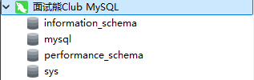
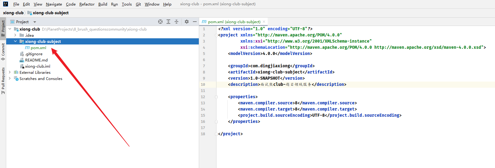
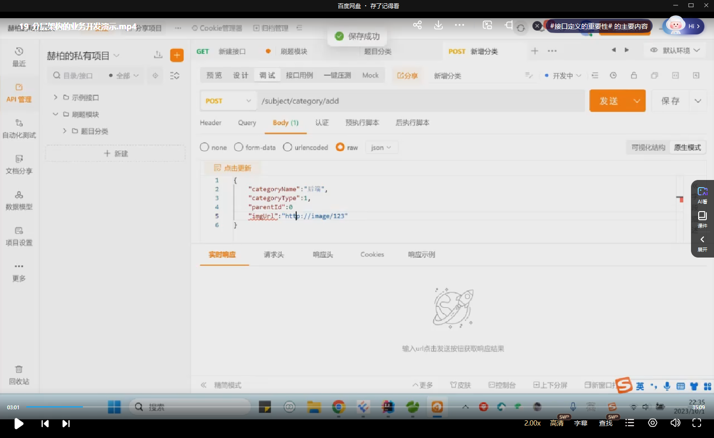

### 面试熊 Club 社区项目


#### 1. 项目简介


##### 1.1 项目启动会


一个从 0 到 1 的社区项目【业务】


想法：

- 一个社区。社区里面我希望面向所有的程序员群体，提供一个交流，学习，招聘等等的程序员圈子。
- 交流的模块，类似脉脉这种圈子的概念
- 提供很多的面试题的学习
- 不止有题目，可以类似牛客网这样，来进行练习的题目的过程
- 模拟面试


##### 1.2 技术选型


- **分析的原则点**
    - 用户量预期多少？
        - 200人同时在线访问社区
        - 后期火了，我预测千人在线
    - 数据体量预期多少？
        - 题目数据
        - 练题数据
        - 博客数据
        - 文件的数据
        - 交流群的数据
        - 用户行为的一些数据
    - 服务器投入预期多少？
        - 4C8G业务服务
            - 前期人少，后端前端公用一个服务器
        - 4C8G中间件服务
- 后端
    - 框架
        - spring
        - springmvc
        - mybatis plus【以上 SSM 】
        - springboot【阿里云版本脚手架：https://start.aliyun.com/】
            - redisstarter
            - mongodbstarter
            - mybatisplusstarter
            - esstarter
            - ...
        - springcloud alibaba【微服务】
            - nacos
            - gateway
            - openfeign
        - satoken【鉴权】
    - 数据库
        - mysql
    - 实时流
        - websocket
    - 分布式任务调度
        - xxljob
    - 流程编排
        - asynctool
    - 缓存
        - redis
        - guava【本地缓存】
    - mq
        - rocketmq（推荐）
    - 分布式事务
        - 基于mq实现的消息驱动柔性事务 最终一致性
    - 搜索引擎
        - elastcsearch
    - 前端负载转发
        - nginx
    - 部署集成
        - Jenkins
    - 全文检索
        - elasticsearch
    - 文件存储
        - minio
    - 其他的一些
        - easyexcel
        - freemarker
- 前端


项目基调：前后端分离，一个对接用户的 C 端项目。


##### 1.3 开发工具选型


- 后端：IDEA
- 前端：我直接用 Webstorm 了
- 项目管理：GitHub
- 包依赖：Maven
- 数据库：MySQL 5.7【我直接 上 8】
- 数据库图形化工具：Navicat
- 接口管理工具：`ApiPost 7` 【我直接 postman】
- Redis ：我直接 Another
- 表建模：元数建模
- 原型设计：Axure 8
- 原型组件库：ant design
- node：`18.18.0`
- 代码生成器：easycode 【IDEA 插件】还有mybatis 的插件


#### 2. 项目开发流程


##### 2.1 刷题模块功能规划 & 原型设计


###### 2.1.1 产品的功能模块


###### 2.1.2 研发功能模块拆分


###### 2.1.3 原型的设计


选型：`axure` + `antdesign` 的组件库


载入元件库


- 刷题首页

  

- 题目的详情

  


##### 2.2 刷题模块数据表设计


这个用到了 PDManer


新建了一个项目


数据模型：


其实还有一张 mapping， 总图里面漏掉了


整个的数据库表建模数据模型：


##### 2.3 项目架构设计


###### 2.3.1 传统的项目


- controller
- biz
- service
- dao


###### 2.3.2 现有的架构


##### 2.4 DDD思想启蒙 & 架构设计原理


req->dto->do->bo->entity->po


> 说实话，没听懂


##### 2.5 安装 Dcoker & Docker 拉取 MySQL 镜像


这里用的京东云


直接创建轻量云主机


这里暂且上了一个 2核8G 的


价格其实我觉得都差不多【试试吧，玩玩儿 京东云】


就这了


我用的 xterminal


改了下密码，直接干进去吧


传新服务器


安装 Docker，


```shell
yum install -y yum-utils device-mapper-persistent-data lvm2
```


```
yum-config-manager --add-repo http://mirrors.aliyun.com/docker-ce/linux/centos/docker-ce.repo
```


```
yum install docker-ce docker-ce-cli containerd.io -y 
```


真的不快


安装完成直接启动


```
systemctl start docker
```


```
systemctl enable docker
docker version 
docker images
```


鸡翅用 的24， 我这 26 肯定够了


还是装 `5.7` 吧


```
docker pull mysql:5.7
```


经典问题果然出现了，拉不下来，配一个阿里云的镜像源


重启，再试一次


还是不行


又换了一个源 https://github.com/DaoCloud/public-image-mirror


感谢


创建一些数据卷


```
mkdir -p /home/service/mysql/data 
mkdir -p /home/service/mysql/conf
cd /home/service/mysql/conf

touch my.cnf

贴入：
[mysqld]
user=mysql
character-set-server=utf8
default_authentication_plugin=mysql_native_password
default-time_zone = '+8:00'
[client]
default-character-set=utf8
[mysql]
default-character-set=utf8
```


创建容器


```
docker run -p 3306:3306 --name mysql -v /home/service/mysql/logs:/logs -v /home/service/mysql/data:/mysql_data -e MYSQL_ROOT_PASSWORD=123456 -d mysql:5.7
```


进入

```
docker exec -it mysql bash 

mysql -uroot -p 
```


没问题，开个防火墙用可视化链接





4 个送的，比 8 少一点


##### 2.6 数据库表建立


直接运行 SQL 脚本


在这里 copy 的，但是这里是有一些问题的，不能直接用，这里直接贴了给的 SQL 文件


###### 2.6.1 题目分类表


```sql
DROP TABLE IF EXISTS `subject_category`;
CREATE TABLE `subject_category`
(
    `id`            bigint(20) NOT NULL AUTO_INCREMENT COMMENT '主键',
    `category_name` varchar(16) DEFAULT NULL COMMENT '分类名称',
    `category_type` tinyint(2) DEFAULT NULL COMMENT '分类类型',
    `image_url`     varchar(64) DEFAULT NULL COMMENT '图标连接',
    `parent_id`     bigint(20) DEFAULT NULL COMMENT '父级id',
    `created_by`    varchar(32) DEFAULT NULL COMMENT '创建人',
    `created_time`  datetime    DEFAULT NULL COMMENT '创建时间',
    `update_by`     varchar(32) DEFAULT NULL COMMENT '更新人',
    `update_time`   datetime    DEFAULT NULL COMMENT '更新时间',
    `is_deleted`    tinyint(1) DEFAULT '0' COMMENT '是否删除 0: 未删除 1: 已删除',
    PRIMARY KEY (`id`)
) ENGINE=InnoDB AUTO_INCREMENT=12 DEFAULT CHARSET=utf8 COMMENT='题目分类';
```


###### 2.6.2 题目标签表


```sql
DROP TABLE IF EXISTS `subject_label`;
CREATE TABLE `subject_label`
(
    `id`           bigint(20) NOT NULL AUTO_INCREMENT COMMENT '主键',
    `label_name`   varchar(32) DEFAULT NULL COMMENT '标签分类',
    `sort_num`     int(11) DEFAULT NULL COMMENT '排序',
    `category_id`  varchar(50) DEFAULT NULL,
    `created_by`   varchar(32) DEFAULT NULL COMMENT '创建人',
    `created_time` datetime    DEFAULT NULL COMMENT '创建时间',
    `update_by`    varchar(32) DEFAULT NULL COMMENT '更新人',
    `update_time`  datetime    DEFAULT NULL COMMENT '更新时间',
    `is_deleted`   int(11) DEFAULT '0',
    PRIMARY KEY (`id`)
) ENGINE=InnoDB AUTO_INCREMENT=64 DEFAULT CHARSET=utf8 COMMENT='题目标签表';
```


###### 2.6.3 题目关系表


```sql
DROP TABLE IF EXISTS `subject_mapping`;
CREATE TABLE `subject_mapping`
(
    `id`           bigint(20) NOT NULL AUTO_INCREMENT COMMENT '主键',
    `subject_id`   bigint(20) DEFAULT NULL COMMENT '题目id',
    `category_id`  bigint(20) DEFAULT NULL COMMENT '分类id',
    `label_id`     bigint(20) DEFAULT NULL COMMENT '标签id',
    `created_by`   varchar(32) DEFAULT NULL COMMENT '创建人',
    `created_time` datetime    DEFAULT NULL COMMENT '创建时间',
    `update_by`    varchar(32) DEFAULT NULL COMMENT '修改人',
    `update_time`  datetime    DEFAULT NULL COMMENT '修改时间',
    `is_deleted`   int(11) DEFAULT '0',
    PRIMARY KEY (`id`)
) ENGINE=InnoDB AUTO_INCREMENT=536 DEFAULT CHARSET=utf8 COMMENT='题目分类关系表';
```


###### 2.6.4 题目信息表


```sql
DROP TABLE IF EXISTS `subject_info`;
CREATE TABLE `subject_info`
(
    `id`                bigint(20) NOT NULL AUTO_INCREMENT COMMENT '主键',
    `subject_name`      varchar(128) DEFAULT NULL COMMENT '题目名称',
    `subject_difficult` tinyint(4) DEFAULT NULL COMMENT '题目难度',
    `settle_name`       varchar(32)  DEFAULT NULL COMMENT '出题人名',
    `subject_type`      tinyint(4) DEFAULT NULL COMMENT '题目类型 1单选 2多选 3判断 4简答',
    `subject_score`     tinyint(4) DEFAULT NULL COMMENT '题目分数',
    `subject_parse`     varchar(512) DEFAULT NULL COMMENT '题目解析',
    `created_by`        varchar(32)  DEFAULT NULL COMMENT '创建人',
    `created_time`      datetime     DEFAULT NULL COMMENT '创建时间',
    `update_by`         varchar(32)  DEFAULT NULL COMMENT '修改人',
    `update_time`       datetime     DEFAULT NULL COMMENT '修改时间',
    `is_deleted`        int(11) DEFAULT '0',
    PRIMARY KEY (`id`)
) ENGINE=InnoDB AUTO_INCREMENT=327 DEFAULT CHARSET=utf8 COMMENT='题目信息表';
```


###### 2.6.5 单选题


```sql
DROP TABLE IF EXISTS `subject_radio`;
CREATE TABLE `subject_radio`
(
    `id`             bigint(20) NOT NULL AUTO_INCREMENT COMMENT '主键',
    `subject_id`     bigint(20) DEFAULT NULL COMMENT '题目id',
    `option_type`    tinyint(4) DEFAULT NULL COMMENT 'a,b,c,d',
    `option_content` varchar(128) DEFAULT NULL COMMENT '选项内容',
    `is_correct`     tinyint(2) DEFAULT NULL COMMENT '是否正确',
    `created_by`     varchar(32)  DEFAULT NULL COMMENT '创建人',
    `created_time`   datetime     DEFAULT NULL COMMENT '创建时间',
    `update_by`      varchar(32)  DEFAULT NULL COMMENT '修改人',
    `update_time`    datetime     DEFAULT NULL COMMENT '修改时间',
    `is_deleted`     int(11) DEFAULT '0',
    PRIMARY KEY (`id`)
) ENGINE=InnoDB DEFAULT CHARSET=utf8 COMMENT='单选题信息表';
```


###### 2.6.6 多选题


```sql
DROP TABLE IF EXISTS `subject_multiple`;
CREATE TABLE `subject_multiple`
(
    `id`             bigint(20) NOT NULL AUTO_INCREMENT COMMENT '主键',
    `subject_id`     bigint(20) DEFAULT NULL COMMENT '题目id',
    `option_type`    bigint(4) DEFAULT NULL COMMENT '选项类型',
    `option_content` varchar(64) DEFAULT NULL COMMENT '选项内容',
    `is_correct`     tinyint(2) DEFAULT NULL COMMENT '是否正确',
    `created_by`     varchar(32) DEFAULT NULL COMMENT '创建人',
    `created_time`   datetime    DEFAULT NULL COMMENT '创建时间',
    `update_by`      varchar(32) DEFAULT NULL COMMENT '更新人',
    `update_time`    datetime    DEFAULT NULL COMMENT '更新时间',
    `is_deleted`     int(11) DEFAULT '0',
    PRIMARY KEY (`id`)
) ENGINE=InnoDB DEFAULT CHARSET=utf8 COMMENT='多选题信息表';
```


###### 2.6.7 判断题


```sql
DROP TABLE IF EXISTS `subject_judge`;
CREATE TABLE `subject_judge`
(
    `id`           bigint(20) NOT NULL AUTO_INCREMENT COMMENT '主键',
    `subject_id`   bigint(20) DEFAULT NULL COMMENT '题目id',
    `is_correct`   tinyint(2) DEFAULT NULL COMMENT '是否正确',
    `created_by`   varchar(32) DEFAULT NULL COMMENT '创建人',
    `created_time` datetime    DEFAULT NULL COMMENT '创建时间',
    `update_by`    varchar(32) DEFAULT NULL COMMENT '更新人',
    `update_time`  datetime    DEFAULT NULL COMMENT '更新时间',
    `is_deleted`   int(11) DEFAULT '0',
    PRIMARY KEY (`id`)
) ENGINE=InnoDB DEFAULT CHARSET=utf8 COMMENT='判断题';
```


###### 2.6.8 简答题


```sql
DROP TABLE IF EXISTS `subject_brief`;
CREATE TABLE `subject_brief`
(
    `id`             bigint(20) NOT NULL AUTO_INCREMENT COMMENT '主键',
    `subject_id`     int(20) DEFAULT NULL COMMENT '题目id',
    `subject_answer` text COMMENT '题目答案',
    `created_by`     varchar(32) DEFAULT NULL COMMENT '创建人',
    `created_time`   datetime    DEFAULT NULL COMMENT '创建时间',
    `update_by`      varchar(32) DEFAULT NULL COMMENT '更新人',
    `update_time`    datetime    DEFAULT NULL COMMENT '更新时间',
    `is_deleted`     int(11) DEFAULT '0',
    PRIMARY KEY (`id`)
) ENGINE=InnoDB AUTO_INCREMENT=280 DEFAULT CHARSET=utf8 COMMENT='简答题';
```


一共 8 个


这个建模实在是鸡肋，鸡翅又在改表结构了


字符集暂时就这样吧


##### 2.7 Git仓库及代码骨架建立


我这儿用GitHub


换成 `-` ，以前踩过一个大坑


这里我直接用 IDEA 新建项目了


看了一下源码结构，分了很多模块，然后根就是 club ，JDK 版本用的 `1.8`


直接这样创建就行了，每个子工程才是一个 Maven 模块


甚至可以把这个 src 直接删了


直接关联到远程仓库


这样就行了

第一个 module ，刷题模块，甚至不是 springboot 工程，就是普通 Maven 模块


直接这样就行了


加一些东西，SRC 也可以直接干掉了





再新建模块


api 模块：


这就是 api 对外接口层了


下一个，application 应用层


下一个 domain 领域层


infra 基础措施层


starter  启动层


common 公共层


整体就是这样了，这其实就是个小的微服务


##### 2.8 代码骨架优化及二次回顾


api 层不要 resources


把本项目所有对外提供的接口放在这里面


starter 启动层， 不要 test ，无关任何业务，纯启动以及聚合当前包的能力


infra 基础措施层，关注自身底层交互的层


domain 层，关注领域能力


common 公共层


> 鸡翅老哥肯定还要改，视频里面这些模块一个全包都没有


application 应用层里面又建了三个新工程


这整个 application 负责接入数据


这就是 DDD 吗，炸裂


##### 2.9 项目结构调整


就是规整包名，我就说它要改吧


api 模块，其实这个项目用不到


starter 层


infra 层


domain 层


common 层


application 层


##### 2.10 SpringBoot 集成


居然用 `2.4.2`  的版本，，， 不能接受


我直接上 `2.7.6` 了


然后指定了仓库


这个感觉不是很有必要


然后就是 starter 层


来一个启动类


直接启动试试


8080 直接跑起来了


##### 2.11 应用层初探 & SpringMVC 集成


application 的 controller 层


这样就可以开始创建 controller  了


测试接口，然后在 starter 模块引入这个包


直接启动试试


没问题


##### 2.12 MySQL、Druid、Mybatis集成


在 infra 层


首先是依赖


这里数据库是 5.7 的，居然上了 8 的连接


这里用的 easycode 代码生成器，以防万一，我也用吧


先来这个分类表


dao 换到 mapper 下了


pageable 相关的东西全部删掉


不报错就行


在 starter 里面引入一下这个模块


写一下扫描


配置一下数据源


测试一下，记得在controller 层引入这个 infra 模块


启动测试一下


数据库肯定连上了


整两条数据

```sql
INSERT INTO `subject_category`
VALUES ('1', '后端', '1', 'https://image/category.icon', '0', 'oYA4HtwGJEsLio6pGrhx5Hzv9XD0', '2024-02-28 03:21:09', null,
        null, '0');
INSERT INTO `subject_category`
VALUES ('2', '缓存', '2', 'https://image/category.icon', '1', 'oYA4HtwGJEsLio6pGrhx5Hzv9XD0', '2024-02-28 03:21:09', null,
        null, '0');
```


试试


没问题，查出来了


##### 2.13 基于Druid配置文件加密


这个地方是明文的，很明显，不安全


来一个工具类


公钥私钥都出来了


再试一次


可以，这样就在代码里面隐藏了我们的数据库密码


而且不影响使用


##### 2.14 分层架构的业务开发演示


这里


这里其实有点问题


就包括最后的源码中，其实并没有用到 plus，炸裂，这里我打算自己改一下了，用 `Mybatis X` 来生成代码





这样就行了，我还引入了 lombok，这个后面鸡翅也引入了，依赖放在 common 里面了


试试


没问题，能用


而且这 ... 不想这样写，直接上一个 Swagger 接口文档先


集成完毕


没毛病


common 里面加了 依赖


在 infra 里面引一下


其实这里不受影响就好了


这里换到了 domain 层，来调，domain 层关注领域能力，在这层去调 infra 基础设施层


先引包


domain 中 实现了一个插入方法


然后在 controller 想去调用


先引进来，然后【这里说到一个东西，用infra 还是 domain，都可以的】


先封装一个通用返回


这里其实已经能用了，但是现在要加上日志的处理


先测试一下


直接在 swagger 里面进行调试了


随便整一个


我这里没插进去


改了一下， 字段没对上，再试一次


再试一次，不知道为什么，我生成的代码没有按照驼峰


我改成和鸡翅一样的了


成功了


我后面又改回去了


改成真正意义上的plus ，还是成功了，因为我执行了 clean，然后重新运行 ，就离谱


还加了一些 plus 的配置，成功了


##### 2.15 日志log4j2集成


放 common 里，还有一个 JSON 解析的


common 不用引了，我们在infra 里面引了，controller 又引了 infra ，所以依赖传递


在 controller 加一个日志打印


这里可以打印 DTO 长什么样子


这里可以看到 BO 是什么样子，最后那层就不加了，我这儿是用的 plus


还要有个配置文件


加载


还要把 boot 带的那个排除一下


重启试试


启动成功，这下插入试试


日志也都出来了，当然也可以使用 AOP 来做切面编程


##### 2.16 precondions的参数校验


第一种是用 guava


还有 commons-lang


修改 controller，在后端做一次校验


效果：


没问题


##### 2.17 刷题模块分类接口定义


分类模块

分类的概念是面试题的大类。其中我们有两种概念，一种是岗位分类，例如后端，前端，测试。一种是岗位下细分的分类，比如后端下细分，框架，并发，集合等等。


- 新增分类【已做】

- 查询分类

  

- 查询大类下分类

  

- 查询分类及标签

  


设计了半天的接口，没有上代码，


当然可以直接在一个接口中全部搞出来


不知道为啥硬要分这么多期


##### 2.18 题目列表及详情接口定义


题目分为单选，多选，判断，简单，四种数据类型，在设计数据的时候，我们去拆分成了题目的主表和其他对应的表来做。


按照原型图设计了一下请求参数和响应


- 查询题目列表

  

  

- 查询题目详情

  

  


