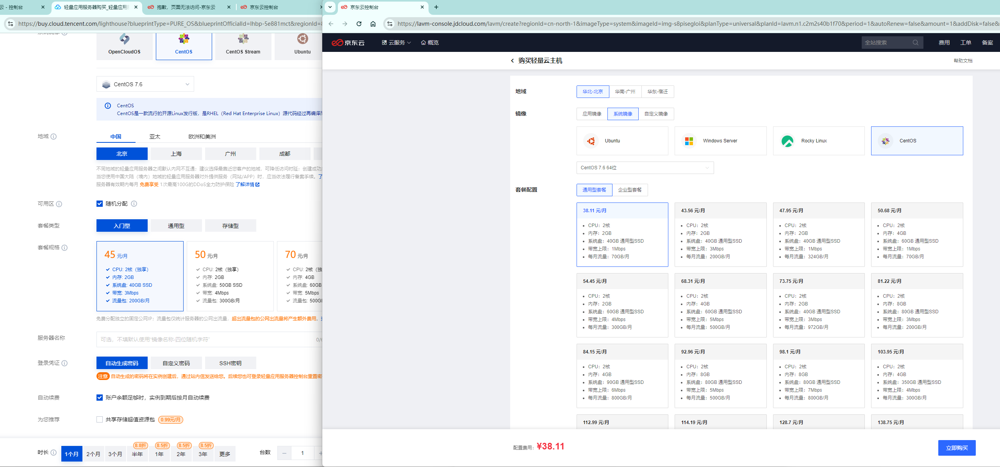
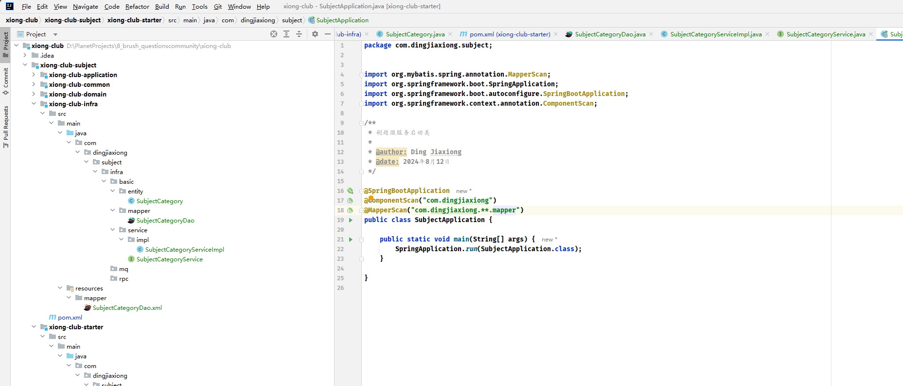
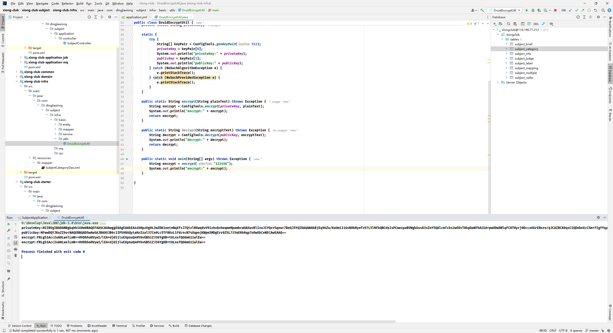
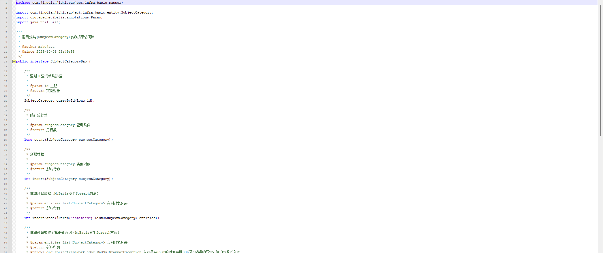
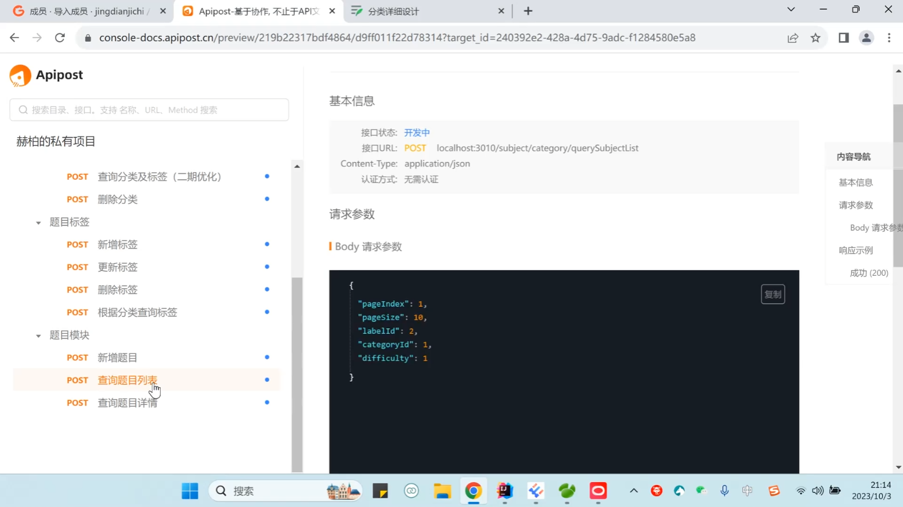
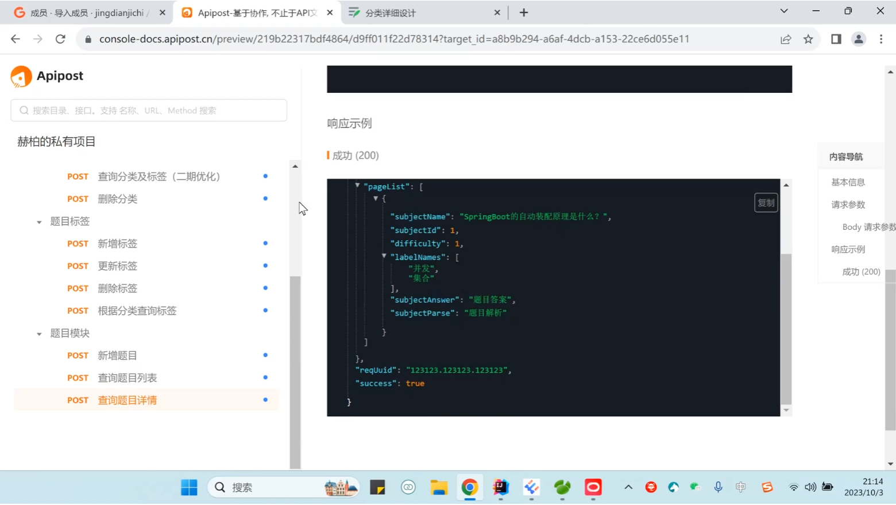
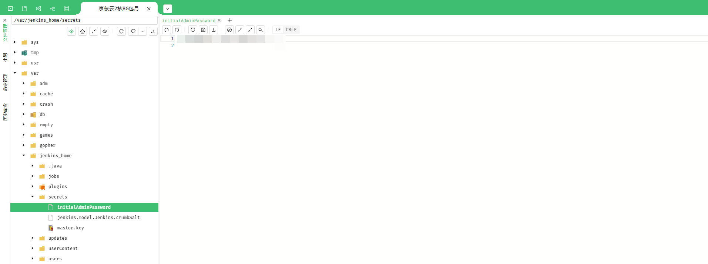
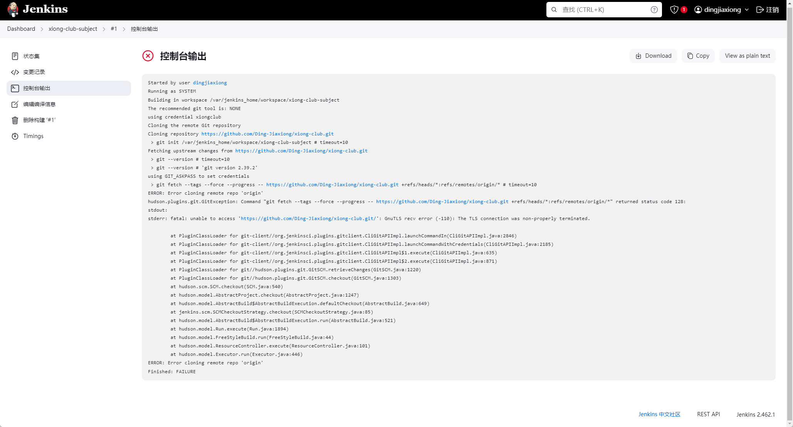
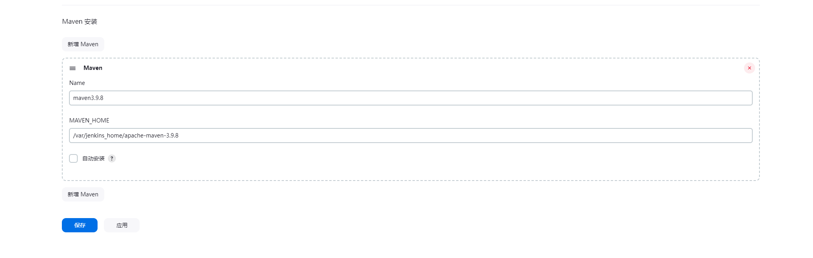
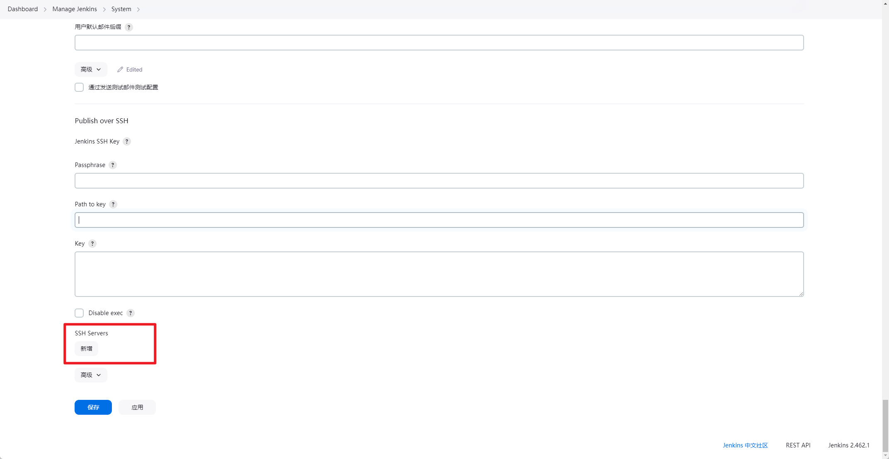

### 面试熊 Club 社区项目


#### 1. 项目简介


##### 1.1 项目启动会


一个从 0 到 1 的社区项目【业务】


想法：

- 一个社区。社区里面我希望面向所有的程序员群体，提供一个交流，学习，招聘等等的程序员圈子。
- 交流的模块，类似脉脉这种圈子的概念
- 提供很多的面试题的学习
- 不止有题目，可以类似牛客网这样，来进行练习的题目的过程
- 模拟面试


##### 1.2 技术选型


- **分析的原则点**
    - 用户量预期多少？
        - 200人同时在线访问社区
        - 后期火了，我预测千人在线
    - 数据体量预期多少？
        - 题目数据
        - 练题数据
        - 博客数据
        - 文件的数据
        - 交流群的数据
        - 用户行为的一些数据
    - 服务器投入预期多少？
        - 4C8G业务服务
            - 前期人少，后端前端公用一个服务器
        - 4C8G中间件服务
- 后端
    - 框架
        - spring
        - springmvc
        - mybatis plus【以上 SSM 】
        - springboot【阿里云版本脚手架：https://start.aliyun.com/】
            - redisstarter
            - mongodbstarter
            - mybatisplusstarter
            - esstarter
            - ...
        - springcloud alibaba【微服务】
            - nacos
            - gateway
            - openfeign
        - satoken【鉴权】
    - 数据库
        - mysql
    - 实时流
        - websocket
    - 分布式任务调度
        - xxljob
    - 流程编排
        - asynctool
    - 缓存
        - redis
        - guava【本地缓存】
    - mq
        - rocketmq（推荐）
    - 分布式事务
        - 基于mq实现的消息驱动柔性事务 最终一致性
    - 搜索引擎
        - elastcsearch
    - 前端负载转发
        - nginx
    - 部署集成
        - Jenkins
    - 全文检索
        - elasticsearch
    - 文件存储
        - minio
    - 其他的一些
        - easyexcel
        - freemarker
- 前端


项目基调：前后端分离，一个对接用户的 C 端项目。


##### 1.3 开发工具选型


- 后端：IDEA
- 前端：我直接用 Webstorm 了
- 项目管理：GitHub
- 包依赖：Maven
- 数据库：MySQL 5.7【我直接 上 8】
- 数据库图形化工具：Navicat
- 接口管理工具：`ApiPost 7` 【我直接 postman】
- Redis ：我直接 Another
- 表建模：元数建模
- 原型设计：Axure 8
- 原型组件库：ant design
- node：`18.18.0`
- 代码生成器：easycode 【IDEA 插件】还有mybatis 的插件


#### 2. 项目开发流程


##### 2.1 刷题模块功能规划 & 原型设计


###### 2.1.1 产品的功能模块


###### 2.1.2 研发功能模块拆分


###### 2.1.3 原型的设计


选型：`axure` + `antdesign` 的组件库


载入元件库


- 刷题首页

  

- 题目的详情

  


##### 2.2 刷题模块数据表设计


这个用到了 PDManer


新建了一个项目


数据模型：


其实还有一张 mapping， 总图里面漏掉了


整个的数据库表建模数据模型：


##### 2.3 项目架构设计


###### 2.3.1 传统的项目


- controller
- biz
- service
- dao


###### 2.3.2 现有的架构


##### 2.4 DDD思想启蒙 & 架构设计原理


req->dto->do->bo->entity->po


> 说实话，没听懂


##### 2.5 安装 Dcoker & Docker 拉取 MySQL 镜像


这里用的京东云


直接创建轻量云主机


这里暂且上了一个 2核8G 的





价格其实我觉得都差不多【试试吧，玩玩儿 京东云】


就这了


我用的 xterminal


改了下密码，直接干进去吧


传新服务器


安装 Docker，


```shell
yum install -y yum-utils device-mapper-persistent-data lvm2
```


```
yum-config-manager --add-repo http://mirrors.aliyun.com/docker-ce/linux/centos/docker-ce.repo
```


```
yum install docker-ce docker-ce-cli containerd.io -y 
```


真的不快


安装完成直接启动


```
systemctl start docker
```


```
systemctl enable docker
docker version 
docker images
```


鸡翅用 的24， 我这 26 肯定够了


还是装 `5.7` 吧


```
docker pull mysql:5.7
```


经典问题果然出现了，拉不下来，配一个阿里云的镜像源


重启，再试一次


还是不行


又换了一个源 https://github.com/DaoCloud/public-image-mirror


感谢


创建一些数据卷


```
mkdir -p /home/service/mysql/data 
mkdir -p /home/service/mysql/conf
cd /home/service/mysql/conf

touch my.cnf

贴入：
[mysqld]
user=mysql
character-set-server=utf8
default_authentication_plugin=mysql_native_password
default-time_zone = '+8:00'
[client]
default-character-set=utf8
[mysql]
default-character-set=utf8
```


创建容器


```
docker run -p 3306:3306 --name mysql -v /home/service/mysql/logs:/logs -v /home/service/mysql/data:/mysql_data -e MYSQL_ROOT_PASSWORD=123456 -d mysql:5.7
```


进入

```
docker exec -it mysql bash 

mysql -uroot -p 
```


没问题，开个防火墙用可视化链接


4 个送的，比 8 少一点


##### 2.6 数据库表建立


直接运行 SQL 脚本


在这里 copy 的，但是这里是有一些问题的，不能直接用，这里直接贴了给的 SQL 文件


###### 2.6.1 题目分类表


```sql
DROP TABLE IF EXISTS `subject_category`;
CREATE TABLE `subject_category`
(
    `id`            bigint(20) NOT NULL AUTO_INCREMENT COMMENT '主键',
    `category_name` varchar(16) DEFAULT NULL COMMENT '分类名称',
    `category_type` tinyint(2) DEFAULT NULL COMMENT '分类类型',
    `image_url`     varchar(64) DEFAULT NULL COMMENT '图标连接',
    `parent_id`     bigint(20) DEFAULT NULL COMMENT '父级id',
    `created_by`    varchar(32) DEFAULT NULL COMMENT '创建人',
    `created_time`  datetime    DEFAULT NULL COMMENT '创建时间',
    `update_by`     varchar(32) DEFAULT NULL COMMENT '更新人',
    `update_time`   datetime    DEFAULT NULL COMMENT '更新时间',
    `is_deleted`    tinyint(1) DEFAULT '0' COMMENT '是否删除 0: 未删除 1: 已删除',
    PRIMARY KEY (`id`)
) ENGINE=InnoDB AUTO_INCREMENT=12 DEFAULT CHARSET=utf8 COMMENT='题目分类';
```


###### 2.6.2 题目标签表


```sql
DROP TABLE IF EXISTS `subject_label`;
CREATE TABLE `subject_label`
(
    `id`           bigint(20) NOT NULL AUTO_INCREMENT COMMENT '主键',
    `label_name`   varchar(32) DEFAULT NULL COMMENT '标签分类',
    `sort_num`     int(11) DEFAULT NULL COMMENT '排序',
    `category_id`  varchar(50) DEFAULT NULL,
    `created_by`   varchar(32) DEFAULT NULL COMMENT '创建人',
    `created_time` datetime    DEFAULT NULL COMMENT '创建时间',
    `update_by`    varchar(32) DEFAULT NULL COMMENT '更新人',
    `update_time`  datetime    DEFAULT NULL COMMENT '更新时间',
    `is_deleted`   int(11) DEFAULT '0',
    PRIMARY KEY (`id`)
) ENGINE=InnoDB AUTO_INCREMENT=64 DEFAULT CHARSET=utf8 COMMENT='题目标签表';
```


###### 2.6.3 题目关系表


```sql
DROP TABLE IF EXISTS `subject_mapping`;
CREATE TABLE `subject_mapping`
(
    `id`           bigint(20) NOT NULL AUTO_INCREMENT COMMENT '主键',
    `subject_id`   bigint(20) DEFAULT NULL COMMENT '题目id',
    `category_id`  bigint(20) DEFAULT NULL COMMENT '分类id',
    `label_id`     bigint(20) DEFAULT NULL COMMENT '标签id',
    `created_by`   varchar(32) DEFAULT NULL COMMENT '创建人',
    `created_time` datetime    DEFAULT NULL COMMENT '创建时间',
    `update_by`    varchar(32) DEFAULT NULL COMMENT '修改人',
    `update_time`  datetime    DEFAULT NULL COMMENT '修改时间',
    `is_deleted`   int(11) DEFAULT '0',
    PRIMARY KEY (`id`)
) ENGINE=InnoDB AUTO_INCREMENT=536 DEFAULT CHARSET=utf8 COMMENT='题目分类关系表';
```


###### 2.6.4 题目信息表


```sql
DROP TABLE IF EXISTS `subject_info`;
CREATE TABLE `subject_info`
(
    `id`                bigint(20) NOT NULL AUTO_INCREMENT COMMENT '主键',
    `subject_name`      varchar(128) DEFAULT NULL COMMENT '题目名称',
    `subject_difficult` tinyint(4) DEFAULT NULL COMMENT '题目难度',
    `settle_name`       varchar(32)  DEFAULT NULL COMMENT '出题人名',
    `subject_type`      tinyint(4) DEFAULT NULL COMMENT '题目类型 1单选 2多选 3判断 4简答',
    `subject_score`     tinyint(4) DEFAULT NULL COMMENT '题目分数',
    `subject_parse`     varchar(512) DEFAULT NULL COMMENT '题目解析',
    `created_by`        varchar(32)  DEFAULT NULL COMMENT '创建人',
    `created_time`      datetime     DEFAULT NULL COMMENT '创建时间',
    `update_by`         varchar(32)  DEFAULT NULL COMMENT '修改人',
    `update_time`       datetime     DEFAULT NULL COMMENT '修改时间',
    `is_deleted`        int(11) DEFAULT '0',
    PRIMARY KEY (`id`)
) ENGINE=InnoDB AUTO_INCREMENT=327 DEFAULT CHARSET=utf8 COMMENT='题目信息表';
```


###### 2.6.5 单选题


```sql
DROP TABLE IF EXISTS `subject_radio`;
CREATE TABLE `subject_radio`
(
    `id`             bigint(20) NOT NULL AUTO_INCREMENT COMMENT '主键',
    `subject_id`     bigint(20) DEFAULT NULL COMMENT '题目id',
    `option_type`    tinyint(4) DEFAULT NULL COMMENT 'a,b,c,d',
    `option_content` varchar(128) DEFAULT NULL COMMENT '选项内容',
    `is_correct`     tinyint(2) DEFAULT NULL COMMENT '是否正确',
    `created_by`     varchar(32)  DEFAULT NULL COMMENT '创建人',
    `created_time`   datetime     DEFAULT NULL COMMENT '创建时间',
    `update_by`      varchar(32)  DEFAULT NULL COMMENT '修改人',
    `update_time`    datetime     DEFAULT NULL COMMENT '修改时间',
    `is_deleted`     int(11) DEFAULT '0',
    PRIMARY KEY (`id`)
) ENGINE=InnoDB DEFAULT CHARSET=utf8 COMMENT='单选题信息表';
```


###### 2.6.6 多选题


```sql
DROP TABLE IF EXISTS `subject_multiple`;
CREATE TABLE `subject_multiple`
(
    `id`             bigint(20) NOT NULL AUTO_INCREMENT COMMENT '主键',
    `subject_id`     bigint(20) DEFAULT NULL COMMENT '题目id',
    `option_type`    bigint(4) DEFAULT NULL COMMENT '选项类型',
    `option_content` varchar(64) DEFAULT NULL COMMENT '选项内容',
    `is_correct`     tinyint(2) DEFAULT NULL COMMENT '是否正确',
    `created_by`     varchar(32) DEFAULT NULL COMMENT '创建人',
    `created_time`   datetime    DEFAULT NULL COMMENT '创建时间',
    `update_by`      varchar(32) DEFAULT NULL COMMENT '更新人',
    `update_time`    datetime    DEFAULT NULL COMMENT '更新时间',
    `is_deleted`     int(11) DEFAULT '0',
    PRIMARY KEY (`id`)
) ENGINE=InnoDB DEFAULT CHARSET=utf8 COMMENT='多选题信息表';
```


###### 2.6.7 判断题


```sql
DROP TABLE IF EXISTS `subject_judge`;
CREATE TABLE `subject_judge`
(
    `id`           bigint(20) NOT NULL AUTO_INCREMENT COMMENT '主键',
    `subject_id`   bigint(20) DEFAULT NULL COMMENT '题目id',
    `is_correct`   tinyint(2) DEFAULT NULL COMMENT '是否正确',
    `created_by`   varchar(32) DEFAULT NULL COMMENT '创建人',
    `created_time` datetime    DEFAULT NULL COMMENT '创建时间',
    `update_by`    varchar(32) DEFAULT NULL COMMENT '更新人',
    `update_time`  datetime    DEFAULT NULL COMMENT '更新时间',
    `is_deleted`   int(11) DEFAULT '0',
    PRIMARY KEY (`id`)
) ENGINE=InnoDB DEFAULT CHARSET=utf8 COMMENT='判断题';
```


###### 2.6.8 简答题


```sql
DROP TABLE IF EXISTS `subject_brief`;
CREATE TABLE `subject_brief`
(
    `id`             bigint(20) NOT NULL AUTO_INCREMENT COMMENT '主键',
    `subject_id`     int(20) DEFAULT NULL COMMENT '题目id',
    `subject_answer` text COMMENT '题目答案',
    `created_by`     varchar(32) DEFAULT NULL COMMENT '创建人',
    `created_time`   datetime    DEFAULT NULL COMMENT '创建时间',
    `update_by`      varchar(32) DEFAULT NULL COMMENT '更新人',
    `update_time`    datetime    DEFAULT NULL COMMENT '更新时间',
    `is_deleted`     int(11) DEFAULT '0',
    PRIMARY KEY (`id`)
) ENGINE=InnoDB AUTO_INCREMENT=280 DEFAULT CHARSET=utf8 COMMENT='简答题';
```


一共 8 个


这个建模实在是鸡肋，鸡翅又在改表结构了


字符集暂时就这样吧


##### 2.7 Git仓库及代码骨架建立


我这儿用GitHub


换成 `-` ，以前踩过一个大坑


这里我直接用 IDEA 新建项目了


看了一下源码结构，分了很多模块，然后根就是 club ，JDK 版本用的 `1.8`


直接这样创建就行了，每个子工程才是一个 Maven 模块


甚至可以把这个 src 直接删了


直接关联到远程仓库


这样就行了

第一个 module ，刷题模块，甚至不是 springboot 工程，就是普通 Maven 模块


直接这样就行了


加一些东西，SRC 也可以直接干掉了


再新建模块


api 模块：


这就是 api 对外接口层了


下一个，application 应用层


下一个 domain 领域层


infra 基础措施层


starter  启动层


common 公共层


整体就是这样了，这其实就是个小的微服务


##### 2.8 代码骨架优化及二次回顾


api 层不要 resources


把本项目所有对外提供的接口放在这里面


starter 启动层， 不要 test ，无关任何业务，纯启动以及聚合当前包的能力


infra 基础措施层，关注自身底层交互的层


domain 层，关注领域能力


common 公共层


> 鸡翅老哥肯定还要改，视频里面这些模块一个全包都没有


application 应用层里面又建了三个新工程


这整个 application 负责接入数据


这就是 DDD 吗，炸裂


##### 2.9 项目结构调整


就是规整包名，我就说它要改吧


api 模块，其实这个项目用不到


starter 层


infra 层


domain 层


common 层


application 层


##### 2.10 SpringBoot 集成


居然用 `2.4.2`  的版本，，， 不能接受


我直接上 `2.7.6` 了


然后指定了仓库


这个感觉不是很有必要


然后就是 starter 层


来一个启动类


直接启动试试


8080 直接跑起来了


##### 2.11 应用层初探 & SpringMVC 集成


application 的 controller 层


这样就可以开始创建 controller  了


测试接口，然后在 starter 模块引入这个包


直接启动试试


没问题


##### 2.12 MySQL、Druid、Mybatis集成


在 infra 层


首先是依赖


这里数据库是 5.7 的，居然上了 8 的连接


这里用的 easycode 代码生成器，以防万一，我也用吧


先来这个分类表


dao 换到 mapper 下了


pageable 相关的东西全部删掉


不报错就行


在 starter 里面引入一下这个模块


写一下扫描





配置一下数据源


测试一下，记得在controller 层引入这个 infra 模块


启动测试一下


数据库肯定连上了


整两条数据

```sql
INSERT INTO `subject_category`
VALUES ('1', '后端', '1', 'https://image/category.icon', '0', 'oYA4HtwGJEsLio6pGrhx5Hzv9XD0', '2024-02-28 03:21:09', null,
        null, '0');
INSERT INTO `subject_category`
VALUES ('2', '缓存', '2', 'https://image/category.icon', '1', 'oYA4HtwGJEsLio6pGrhx5Hzv9XD0', '2024-02-28 03:21:09', null,
        null, '0');
```


试试


没问题，查出来了


##### 2.13 基于Druid配置文件加密


这个地方是明文的，很明显，不安全


来一个工具类





公钥私钥都出来了


再试一次


可以，这样就在代码里面隐藏了我们的数据库密码


而且不影响使用


##### 2.14 分层架构的业务开发演示


这里


这里其实有点问题





就包括最后的源码中，其实并没有用到 plus，炸裂，这里我打算自己改一下了，用 `Mybatis X` 来生成代码


这样就行了，我还引入了 lombok，这个后面鸡翅也引入了，依赖放在 common 里面了


试试


没问题，能用


而且这 ... 不想这样写，直接上一个 Swagger 接口文档先


集成完毕


没毛病


common 里面加了 依赖


在 infra 里面引一下


其实这里不受影响就好了


这里换到了 domain 层，来调，domain 层关注领域能力，在这层去调 infra 基础设施层


先引包


domain 中 实现了一个插入方法


然后在 controller 想去调用


先引进来，然后【这里说到一个东西，用infra 还是 domain，都可以的】


先封装一个通用返回


这里其实已经能用了，但是现在要加上日志的处理


先测试一下


直接在 swagger 里面进行调试了


随便整一个


我这里没插进去


改了一下， 字段没对上，再试一次


再试一次，不知道为什么，我生成的代码没有按照驼峰


我改成和鸡翅一样的了


成功了


我后面又改回去了


改成真正意义上的plus ，还是成功了，因为我执行了 clean，然后重新运行 ，就离谱


还加了一些 plus 的配置，成功了


##### 2.15 日志log4j2集成


放 common 里，还有一个 JSON 解析的


common 不用引了，我们在infra 里面引了，controller 又引了 infra ，所以依赖传递


在 controller 加一个日志打印


这里可以打印 DTO 长什么样子


这里可以看到 BO 是什么样子，最后那层就不加了，我这儿是用的 plus


还要有个配置文件


加载


还要把 boot 带的那个排除一下


重启试试


启动成功，这下插入试试


日志也都出来了，当然也可以使用 AOP 来做切面编程


##### 2.16 precondions的参数校验


第一种是用 guava


还有 commons-lang


修改 controller，在后端做一次校验


效果：


没问题


##### 2.17 刷题模块分类接口定义


分类模块

分类的概念是面试题的大类。其中我们有两种概念，一种是岗位分类，例如后端，前端，测试。一种是岗位下细分的分类，比如后端下细分，框架，并发，集合等等。


- 新增分类【已做】

- 查询分类

  

- 查询大类下分类

  

- 查询分类及标签

  


设计了半天的接口，没有上代码，


当然可以直接在一个接口中全部搞出来


不知道为啥硬要分这么多期


##### 2.18 题目列表及详情接口定义


题目分为单选，多选，判断，简单，四种数据类型，在设计数据的时候，我们去拆分成了题目的主表和其他对应的表来做。


按照原型图设计了一下请求参数和响应


- 查询题目列表

  

  

- 查询题目详情

  

  


##### 2.19 分类接口开发


这里为啥不用 querymapper 呢，而且你一直说你业务不熟练，那你还卖课 ... 


##### 2.20 根据岗位查询分类接口开发


换了一下错误的日志，


试一下，啥也不传


带上分类 ID，是这个 parent_id


没问题


##### 2.21 标签及题目接口定义


这里莫名其妙就多了一个更新接口，好好好


哈哈哈，其实他还没做


还有删除分类接口


新增标签也写了【看错了，是定义】


题目标签：

- 新增标签

  

- 更新标签

  

- 删除标签

  

- 根据分类查询标签

  


题目模块：

- 新增题目

  

- 查询题目列表

  

- 查询题目详情

  


##### 2.22 分类模块接口开发


更新分类接口


我自己加上试试 


删除分类接口


应该是逻辑删除


没问题


好了【这里他比较炸裂的是，没有自己写了一个更新逻辑删除的东西 ... 离谱】


我是直接用了 plus 的实现，直接removebyId，哈哈哈哈


这里把分类模块全部接口都测了一遍，没啥问题


那个时间说的是之后会处理


##### 2.23 标签基础模块开发


就是这张表，直接代码生成器


这里没用 鸡翅那个，还是用的 `mybatis -X` 【easycode 不喜欢】


新建controller ，这里我还是选择了用 plus 的方式，直接写了增删改 三个接口


其实标签字段可以直接用 json 字段存啊，就离谱，还搞了个关联表


对这个关系表也动一个代码生成器


##### 2.24 分类下标签接口开发


代码生成完成，实现之前的那个接口，分类下查出所有标签那个接口


##### 2.25 接口测试


标签接口就大致完成，完整测试一下


新增标签


没问题，多来几个


更新标签


没问题


删除标签


没问题


查询分类下标签


给 mapping 做点数据


然后查一下


没问题


##### 2.26 新增题目接口开发（题目映射处理）


新增题目接口


还是先生成基础代码，五个表全部生成，题目信息、单选、多选、简答、判断


依然是 plus 的形式


还是 controller 直接开始


这里的实现上了策略和工厂模式


info 主表的插入其实就这样就行了，但是还有四种类型的题目，也要插入


【这里没有测试】，讲得真的烂，视频也杂乱，【 网盘第 33 集 和 32 集的结尾是重复的】


##### 2.27 分页处理封装


入参


返回实体


这里居然没有用 mybatis-plus 的分页插件


##### 2.28 题目列表开发


日志改了一下


##### 2.29 查询题目信息接口开发


太随意了，不写就不写


##### 2.30 新增题目接口测试


新增单选题目


```
{
  "categoryIds": [
        4,
        5
   ],
  "labelIds": [
      2, 
      3
   ],
  "optionList": [
    {
      "isCorrect": 1,
      "optionContent": "自动的",
      "optionType": 1
    },
    {
      "isCorrect": 0,
      "optionContent": "其实是用配置文件",
      "optionType": 2
    }
  ],
  "subjectDifficult": 1,
  "subjectName": "SpringBoot自动装配原理是什么？",
  "subjectParse": "题目解析",
  "subjectScore": 2,
  "subjectType": 1
}
```


创建成功


数据库


有点小问题，对应的问题 id 没插进来，还有默认的未删除也没有生效


看下mapping


这设计的 ... 一言难尽


这里我可以直接不传就可以自动设置了


mapping 这里也是


多选也是


还加上了事务注解


然后就是那个关联的题目 id


plus 框架会设置上去，我们直接拿就行了


再试一次


插入成功，看看数据库


题目信息


单选题目表


关系表


没问题


新增多选题


就是正确答案两个都设置成 1 了，当然这只是个例子，数据库，改一下题目类型为 2 就行，忘记改了艹


再来一次，数据库


关联题目 id 是 2


关系表


没问题


插入判断题目


成功，数据库


判断题版


直接就插进来了


关系表也没有问题


新增简答题：


报错了


有地方空指针了


type 写错了，写成 6 了，没这种题目，再试一次


OK，数据库


题目表没问题


没问题


关系表，有一点问题，这个简答他自己的 id 居然从5开始的


感觉是这种原因


因为这儿的 id 也不是 4，可以手动改 了【算了，不用关心了，之前有误操作】


我发现一个问题，截断表、重建表都没用


没救了，truncate 也不行


绝了


我把这儿手动置空了一下就行了，离谱，没看懂，它好像直接把题目 id 拿过来继承了


这样肯定也行，之前那个转换，把 题目 id 一块拿过来了


没毛病


##### 2.31 jacksonconverter初探 & 查询题目列表测试


我这儿的分页倒是直接就返回了【鸡翅那报了错，然后说加上一个配置】


这样可以避免外面传空参时直接报错的问题


没影响，但是如果我把 type 条件去掉


会查出来 5 个，前两个是一毛一样的


看出来了， mapping 表里面有两条脏数据，这下可以了


##### 2.32 空值全局处理


其实我这里并没有出现鸡翅的问题


这样就行了，直接在配置类里面配置【但是鸡翅的还是没有把标签信息带上的】


##### 2.33 查询题目测试


简答题


 判断题


答案也查出来了


单选


只有一个正确答案

多选


多个正确答案【没问题】


##### 2.34 SQL拦截器自动翻译


其实这个我之前就已经做了


看日志


现在要做的是对这些问号进行一些处理，让查询更直观


在 infra 层


注入


之前那个 yml 配置就可以不要了，直接重启看看


现在的日志


没毛病啊


##### 2.35 域名购买


买一个吧


先搞一个信息模板


当然我之前已经搞过了


直接注册域名


就这了


直接买了，这玩意儿首年都便宜，他就是一个解析的作用


##### 2.36 传统部署形式


到现在刷题模块貌似就差不多了


这里又开始讲得稀碎了，这个插件我选择了和我springboot 一样的版本 `2.7.6`


直接 clean 然后 install 


就出了一个这个东西，先试试在本地运行 `java -jar` 命令


没问题，下面是自动部署的方式


##### 2.37 CICD jenckins 实现自动打包持续集成


`docker search jenkins`


拉取镜像 `docker pull jenkins/jenkins:lts` 


这个就相当慢了


等拉下来


启动容器：


要先有一个 java 环境


```
yum install -y java-1.8.0-openjdk.x86_64
```


然后启动Jenkins 容器


```docker
docker run -d -u root -p 8080:8080 -p 50000:50000 -v /var/jenkins_home:/var/jenkins_home -v /etc/localtime:/etc/localtime --name jenkins jenkins/jenkins:lts
```


开个端口


访问





复制过去


初始化工作


安装推荐的插件


等他安装就行了


感觉还要在Linux 上搞一个 Maven


随便整了一下


进来了


保存并完成


保存并完成


开始使用


哇哦


直接整一个 item 项目


保存


回到仪表盘


直接开始构建





这里是直接报错了


感觉就是拉不下来


试了好多次


卡在拉代码，擦


再试，我把 `https` 改成 `http`  了，太慢了，可能是我把那个图片也传上去了


丢，还是连不上【有没有可能是因为 GitHub 它就是连接不上，试试 Gitee，好久没用了】


看看这次效果怎么说


这次就成功了，离谱，果然是GitHub的原因


而且就放在这里了，还要配置一下构建


试试


额


行，直接拷贝一份过去就行


这里面就有了， `/var/jenkins_home/apache-maven-3.9.8`





再试一次


它是在说找不到 pom


再试一次


可以了，开始构建了，在下jar 包


一次成功，厉害了


而且放到了我们的 Maven 仓库里面【虽然我并没有找到】


但是确实是打包成功了，试试直接启动


没问题，也可以启动成功，尝试调用一下接口，开个端口


试试


没问题，


服务器这边也出日志了，当然现在还是我们手动启动的，下面就要上脚本来配合了


##### 2.38 Jenkins配合shell实现自动部署


就我们再次执行这个构建，它会自己去拉新的代码的


直接也是成功了


没问题，确实是最新的


而且最新的 jar 包 也打出来了，当然我这里是刚刚手动把项目停掉了


现在就没有，我们现在要做的，是在构建的时候让项目自动也跑起来 


在 clean 和 install 完成后，执行脚本


这里要配置一下 SSH 服务器


先下一个这个插件


完成之后，返回





这里新增一个


就真实想部署项目的服务器 ip


这里要输入服务器的密码


测试链接成功就行，保存


再回来


这下就可以执行 ssh 命令了


这里用了一大段脚本呢


```shell
cp /var/jenkins_home/workspace/xiong-club-subject/xiong-club-subject/xiong-club-starter/target/xiong-club-starter.jar /var/jenkins_home/jar/
#!/bin/bash
APP_NAME=xiong-club-starter.jar
LOG_NAME=xiong-club-starter.log

pid=`ps -ef | grep $APP_NAME | grep -v grep|awk '{print $2}'`

function is_exist(){
pid=`ps -ef | grep $APP_NAME | grep -v grep|awk '{print $2}'`
if [ -z ${pid} ]; then
String="notExist"
echo $String
else
String="exist"
echo $String
fi
}

str=$(is_exist)
if [ ${str} = "exist" ]; then
echo " 检测到已经启动的程序，pid 是 ${pid} "
kill -9 $pid
else
echo " 程序没有启动了 "
echo "${APP_NAME} is not running"
fi

str=$(is_exist)
if [ ${str} = "exist" ]; then
echo "${APP_NAME} 已经启动了. pid=${pid} ."
else
source /etc/profile
BUILD_ID=dontKillMe
nohup java -Xms300m -Xmx300m -jar /var/jenkins_home/jar/$APP_NAME   >$LOG_NAME 2>&1 &
echo "程序已重新启动..."
fi
```


保存，再试一次，试试


构建成功了，看看有没有跑起来


确实是复制过去了


厉害了，跑起来了，后台启动的


试试接口


没问题，这样就完成了全自动了，我超


厉害，这就是自动部署


##### 2.39 docker 安装 minio


【搭建自己的 oos 服务器】


```
docker search minio
```


```
docker pull minio/minio
```


这里又要等一下了


OK，直接启动容器


```
docker run -p 9000:9000 -p 9090:9090 \
 --name minio \
 -d --restart=always \
 -e "MINIO_ACCESS_KEY=minioadmin" \
 -e "MINIO_SECRET_KEY=minioadmin" \
 -v /mydata/minio/data:/data \
 minio/minio server \
 /data --console-address ":9090" -address ":9000"
```


开个端口：


9090 也要开应该


出来了


密码就是之前设置那个


这样就直接进来了，这和 阿里云 oos 还是很像的，当然我们要通过代码来操作这个东西


##### 2.40 oss 服务抽取思想以及模块开发


就是要单独做一个服务


新的 Maven 模块


这个就是我们专门的对象存储服务，对外提供接口就行了


加依赖


这个服务跑在 4000 端口


能跑起来就行


加上 minio  的依赖

新增配置类


工具类


##### 2.41 minio 初步测试


启动试试，随便创建一个桶先


调用接口


没问题


##### 2.42 oss 模块扩展 & 传统 service & 抽取 fileService & 适配器模式详解与改造


这里用到适配器模式了，之前是用到原始的接口然后每种 oss 服务都去搞一个实现类，


先抽取出 fileService 


如果改成 aliyun


当然这是返回的死的，


我们没有用 阿里云的 oss，适配器就是为了封装适配各种接口，解决可能存在的不兼容的问题


##### 2.43 Docker 安装 nacos 及动态配置


现在的问题，虽然有了适配器，但是想要切换，还是得来改这个 `yml` 文件，nacos 就可以作为一个配置中心


来吧，安装


```
docker search nacos
```


我这小 8 G 感觉都要不够用了 


```
docker pull nacos/nacos-server
```


等待完成


启动容器


```
docker run -d \
  --name nacos \
  --privileged  \
  --cgroupns host \
  --env JVM_XMX=256m \
 --env MODE=standalone \
  --env JVM_XMS=256m \
  -p 8848:8848/tcp \
  -p 9848:9848/tcp \
  --restart=always \
  -w /home/nacos \
  nacos/nacos-server
```


开个端口 8848 


访问一下啊


没问题

新建一个 配置


就在 public 下


直接发布


这样就存下来了


##### 2.44 nacos 实现属性动态切换


加入依赖


单体就用这个，之后换微服务还会换


还要一个日志


之前都写错了，我们用的 `2.7.6 `


这里也是


配置一下


测试一下


其实日志都能看见，已经连上了


这个读取到的就是我们 nacos 配置中心里面的配置了，在界面重新发布


直接再次请求


擦，我的没刷新，噢噢噢噢，还要开一个 9848 的端口


再试一次

现在配置中心是 


这次没问题了，直接改成 minio 试试


直接再请求


成功了, 蛙趣


##### 2.45 nacos 实现 bean 动态加载


现在的问题是值虽然能动态改变了，但是加载的实现类，就是我们那个适配器没变啊


这就解决这个问题，现在就要换依赖了

 


这里我随便上了一个要新不新的版本，先用着吧，有问题再说


感觉上一个 


官方也没有写 2.7 用啥版本，差不多就得了，上个 2021 的我觉得差不多


就决定是你了！ 别让我失望


新建配置文件


application 中留这些就行了


并且新建一个配置


这两个地方加上注解


好，还是让我失望了


换成这个再试一次


东搞西搞还是被我搞出来了


没问题，我直接修改配置文件看看会不会刷新 bean


日志明显动了一下啊


牛逼！！！！卧槽！！！！


我又改回来了，没毛病


确实是有一个监听在的


##### 2.46 标签业务改动


要涉及到和分类做交互，之前其实我没有删


就这个东西，我用的 plus ，就没改啥东西


不知道改了些啥，启动刷题服务测试一下


其实就是要把这个给加上了


新增成功，看看分类 id 有没有带上


没问题，带上了，之前新增的时候没有带上这个


查询的时候


还是要改一下接口，之前实现那个逻辑是根据 mapping 匹配来查的


1 没有匹配的，当然查不出来了，如果查 4 


4 就能出2 和 3 的标签


所以现在又在改代码了，改完之后，如果直接 查 1


没问题，直接把 MySQL 查出来了


##### 2.47 阿里云脚手架工具


https://start.aliyun.com/


讲了下怎么通过这个来帮忙减少版本冲突，


嗦嘎，之前我强行试出来的 


这个版本对应关系就肯定没问题的


我强行试出来的，6666


##### 2.48 登录鉴权框架初探


https://gitee.com/dromara/sa-token，用的这个


##### 2.49 鉴权设计-RBAC模型讲解


RBAC 模型（role-based access control）

非常成熟的安全的模型概念，基于角色帮助我们把授权和用户的访问控制来做结合。

User（用户）用户就是指我们的系统使用者。

PerMission（权限）用户我们对系统的操作，访问哪些东西，可以操作写入操作等等。实际的例子，比如新增题目。

Role（角色）我们去把一组的权限，去做集合，就得到了角色。

核心思想其实就是把角色和权限做关联，实现整体的一个灵活访问，提高我们的系统的安全性和管理型。基于这个模型，我们的开发速度还有粒度的粗细也都是十分好控制的。

优点：

灵活，安全，简化管理。


###### 2.49.1 RBAC-0 模型


用户和角色是一个多对多的关系，角色和权限也是一个多对多关系。


###### 2.49.2 RBAC-1 模型


多了一个继承的概念。

比如一个业务部门，经理，主管，营业员。主管的权限肯定不能大于经理，营业员不能大于主管。

子角色的范围一定会小于父角色。


###### 2.49.3 RBAC-2 模型


角色互斥，基数约束，先决条件等等。

角色互斥：同一个用户，不能被分配到复制的角色，比如说，你是一个采购，那你就不能分配销售。

基数约束：一个角色分配的用户数量是有限的。比如有一个公司的架构师，最多只能有三个。

先决条件：你 想获得架构师的角色，那你必然得先是一个资深工程师的角色。


**权限**


他的含义其实是非常广泛的，可以是菜单，页面，字段，数据。

菜单权限：

页面权限：

字段权限：

数据权限：

操作权限：


**用户组**


平台的用户基数非常大，角色也非常的多，如果说我给每个用户都操作一下角色，就非常的麻烦。我们其实抽象一层，组的概念，把同类的用户，放在一起，直接拥有相同的权限。

非常有益于减少工作量，一些管理方面也非常合适。用户组抽象到实际中，其实就是部门啊，科室啊。


##### 2.50 鉴权数据模型设计


用户信息表


角色表


用户角色表


权限表


角色权限关联表


关系图


